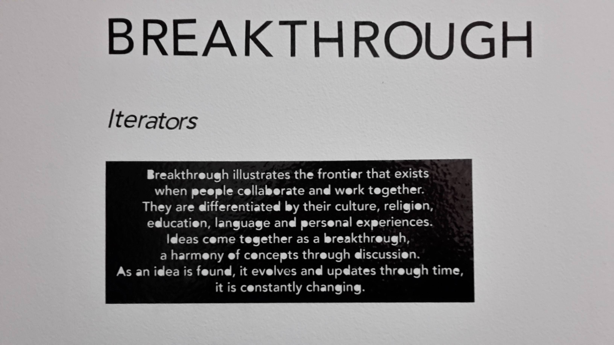

In january 2019 I participated in a programm called "ECE Makers" proposed by my school. I went to San Francisco with 30 of my schoolmates. We were taught about the Silicon Valley mindset, we attended events such as Hello Tomorrow and pitch nights. We also had access to a giant makerspace, TheShop, and were taught mig welding, 3D printing, laser cutting, metal work and basic electronics.

The aim of the programm was to have us organize an art exhibit. We had to create the art pieces ourselves, organize the space and promote the event.

Here is the art piece my group came up with :  

Each of these heads represent a different character with a different personality. They are all connected by strips of lights, each pulse represents a 'communication'. Since they are different they communicate at a different rate. When they all manage to communicate at the same time it creates a breakthrough and the pulse of light goes to the ceiling.